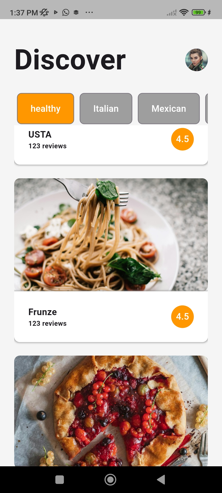
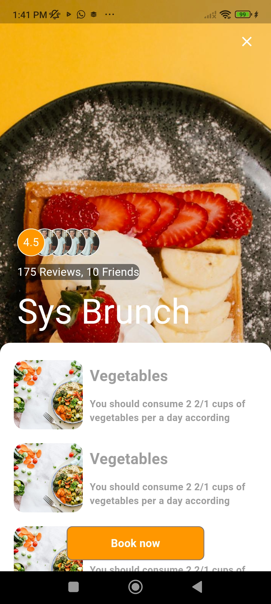

# untitled7

A new Flutter project.
 ## Getting Started
The Restaurant List App is a Flutter-based mobile application designed to provide users with an easy way to browse and filter restaurants. The app showcases modern UI/UX principles and utilizes an API to dynamically load restaurant data.
This project is a starting point for a Flutter application.

Usage
Launch the app to view the list of restaurants.
Use the search bar to find restaurants by name.
Apply filters to narrow down the list based on cuisine, price, or location.
Tap on a restaurant to view detailed information and available dishes.

A few resources to get you started if this is your first Flutter project:

- [Lab: Write your first Flutter app](https://docs.flutter.dev/get-started/codelab)
- [Cookbook: Useful Flutter samples](https://docs.flutter.dev/cookbook)

For help getting started with Flutter development, view the
[online documentation](https://docs.flutter.dev/), which offers tutorials,
samples, guidance on mobile development, and a full API reference.
